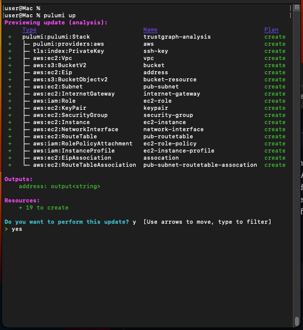
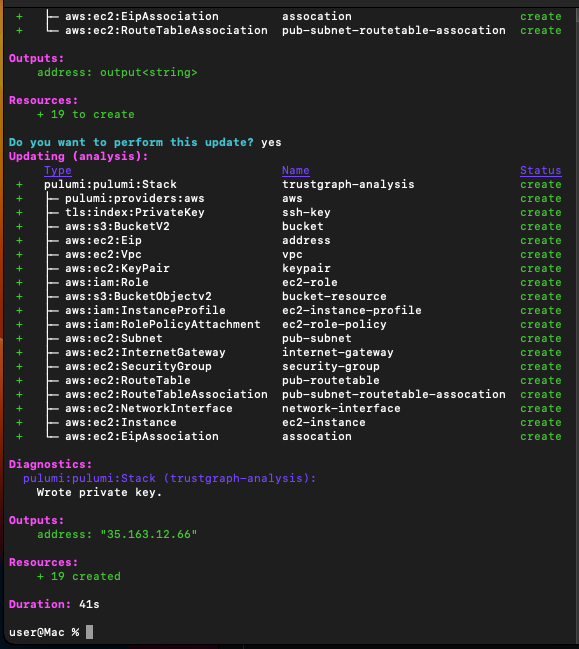

# Deploy

## Deploy with Pulumi

```
pulumi up
```

It will offer you a prompt about deployment, say yes.
(Type y and hit RETURN).



## Completion

If everything works, Pulumi will show you the IP address that was
created, and also creates an SSH private key file.



This is needed to get SSH to handle the key file...

```
chmod 600 ssh-private.key
```

## Finalise the deployment

You have the IP address you were given above?  Replace x.x.x.x with that
IP address and login:

```
ssh -i ssh-private.key ubuntu@x.x.x.x
```

You should get a prompt like...

```
   ubuntu@ip-172-38-49-223:~$ 
```

The TrustGraph installation is scripted and kicks off when the instance
boots, you can track the install output in the `/tmp/output` file:

```
tail -f /tmp/output
```

Track the log until things come to a halt.

When it finishes, the last bit of text should be launching something called
zookeeper, the details aren't important, but it shows the install completed
successfully.

Ctrl-C to get back to the prompt.  Type 'exit' to log out of SSH.

## Create tunnels

Time to use a more complex SSH command:

More complex SSH command.  Replace x.x.x.x with your IP address:

```
ssh -L 3000:0:3000 -L 8088:0:8088 -L 8888:0:8888 -L 3010:0:3010 -i ssh-private.key ubuntu@x.x.x.x
```

This is the same as the last, but there are _four_ new -L option statements
for port numbers 3000, 3010, 8088 and 8888, which open tunnels to be able
to talk directly to the services running on the instance.

The deployment deploys some network services, but they are not accessible 
from outside the instance, so the above command opens network tunnels
over SSH to be able to connect, so you don't need to worry about
malicious actors connecting to your running service.

