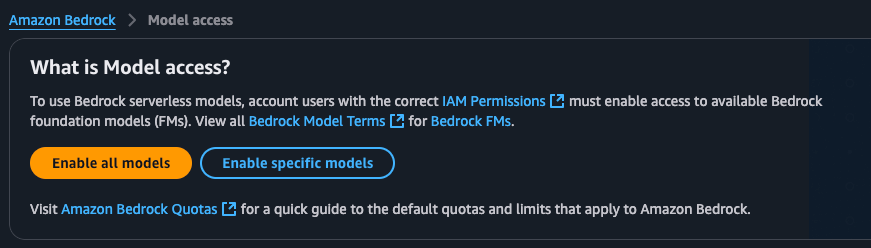
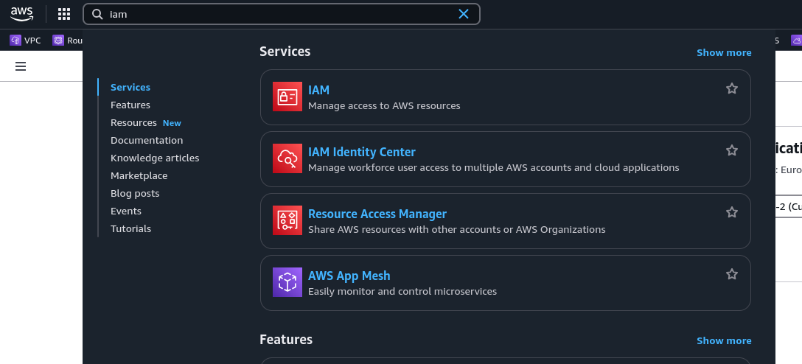
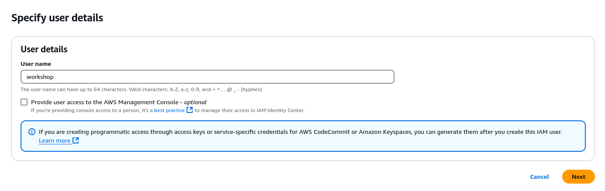
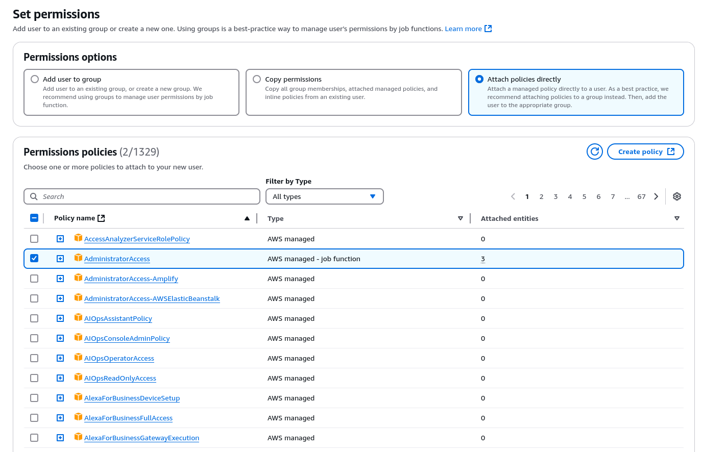
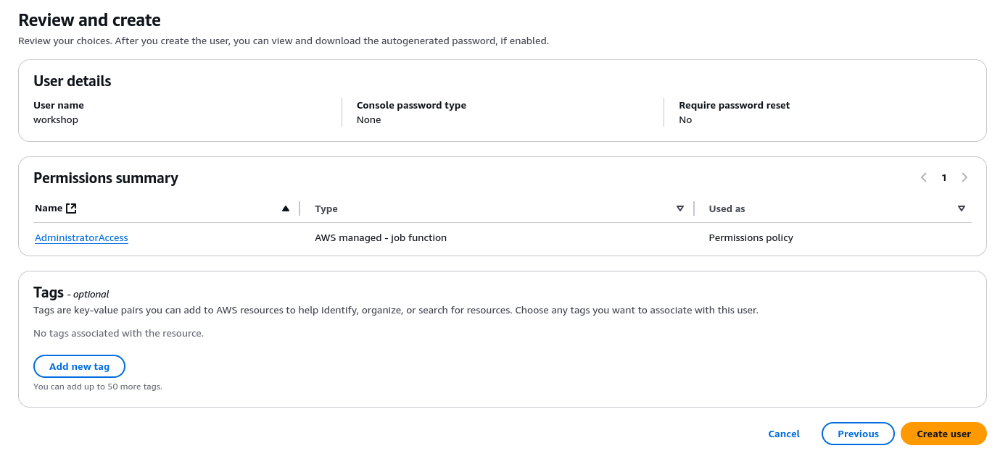
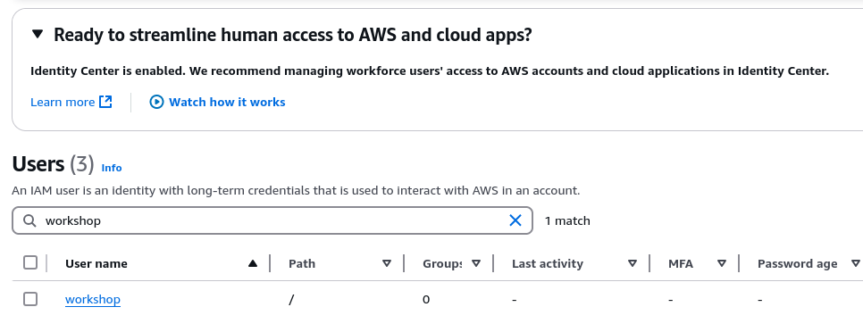
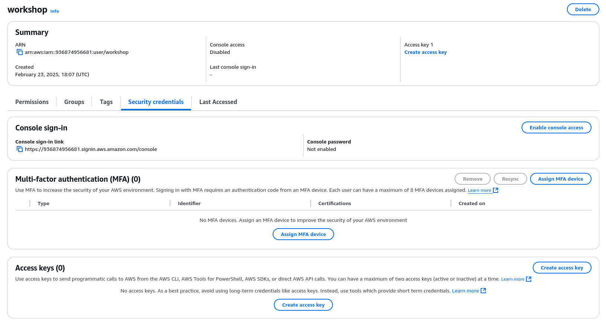
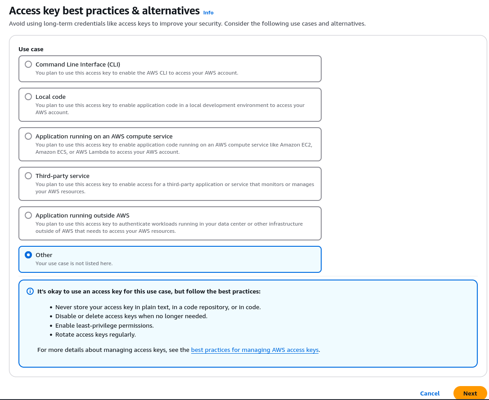
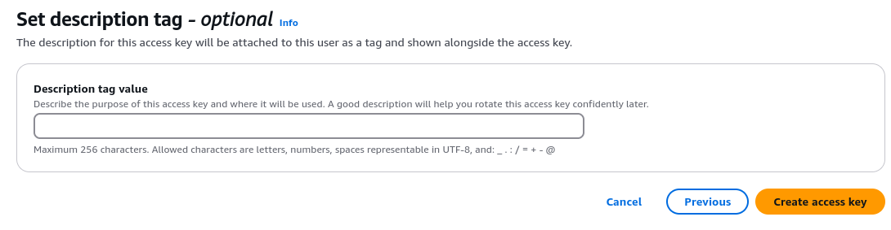
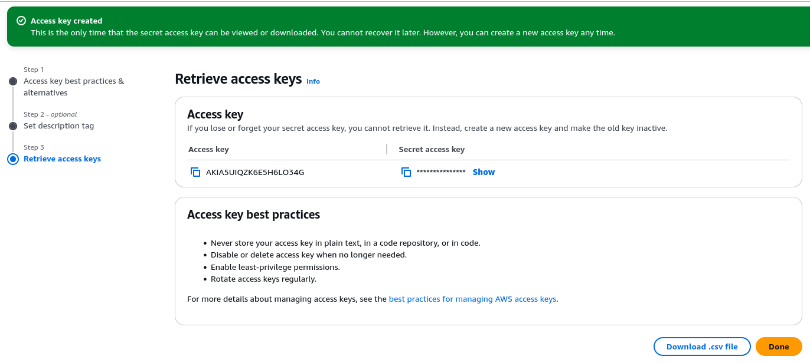

# Prepare AWS

## You need...

A working AWS account with credentials, and Bedrock enabled.  If you don't
have an AWS account you can create one here:

  https://signin.aws.amazon.com/signup?request_type=register

The rest of this page deals with creating credentials and enabling Bedrock.

You would expect to be given a compute credit at the workshop which should
cover the costs of everything you would do at the workshop.  Be sure to
[undeploy](docs/undeploy.md) when you are done
to avoid racking up extra costs.

## Enable Bedrock models

This process uses an LLM hosted on AWS Bedrock.  These models need to be
switched on for use in the Bedrock part of the AWS console.

We'll be using the us-west-2 region.  Different regions offer different
models, and us-west-2 is less busy than other regions and has a full set
of models available.

- Log into the AWS console
- Select us-west-2 region (Oregon).  The region selector is at the top,
  near the right-hand side of the screen.
- Search for Bedrock in the resource search bar, at the top of the screen,
  left hand side, select "Amazon Bedrock".
- On the Bedrock screen look for Model Access on the LHS.
- Select Modify Model Access
- If offered 'Enable All Models' use that.



- Otherwise, search for Anthropic and enable all the models you see.
- Continue through the dialogues until you Submit.  You may have to submit
  some information to get model access.
- The model should change from requested to available, takes a couple of
  minutes.  Maybe go and set some other stuff up, but leave this page open
  so you can refresh and see that it got enabled.

## Credential management

This bit needs your concentration, as some credentials are going to be
created which provide access to your AWS account.  If you accidentally
send these credentials to the wrong person or check them into Github
and publish them on the internet, it gives other people access to your
account, so treat these as passwords.

If you're using an AWS account you already owned, and have a profile setup,
you can skip this bit and just use the profile you have set up.
Just make sure to set AWS_PROFILE to the name of your AWS profile
before launching the deployment.

Here's a video of someone accidentally live-streaming their crypto seed
phrase and losing $100k: https://www.youtube.com/watch?v=4RALeCRTw6Y

Do yourself a favor, and set yourself a reminder to delete the IAM User
once the workshop is done.

### Find the IAM resources in the AWS console

This is done by searching for IAM in the resource search box.



### Create an IAM user

Select "Users" and "Create User".  Give the user a name.  The user does
not need access to the AWS console.



Select "Attach policies directly" and give the user the
AdministratorAccess policy.  This lets the user deploy to AWS.



You are shown a summary; go ahead and create the user.



### Create access keys

At the IAM user console, find the user you just created and select it.



You can see an access keys panel which will be empty; select
Create Access Key.



A set of use cases is shown, select Other.



Put something useful in the description tag if you want, and create the
access key.



Finally, the access credentials are available on this screen.
There are two parts, the access key and secret access key, which is
not displayed on this screen.



### Create profile

If you haven't used AWS credentials before, you're going to need to
set up the credentials file:

```
mkdir ~/.aws
touch ~/.aws/credentials
```

Set up a profile for the workshop which looks like this.  You do this
by opening a text editor and adding this text to the `~/.aws/credentials`
file.

```
[workshop]
aws_access_key_id = [access key goes here]
aws_secret_access_key = [secret access key goes here]
region = us-west-2
```

You can put that at the end of the file.  The bit of text `[workshop]`
gives this a profile name of workshop, we'll set this later.

## What's next?

Next: [Prepare to deploy](prepare.md)

