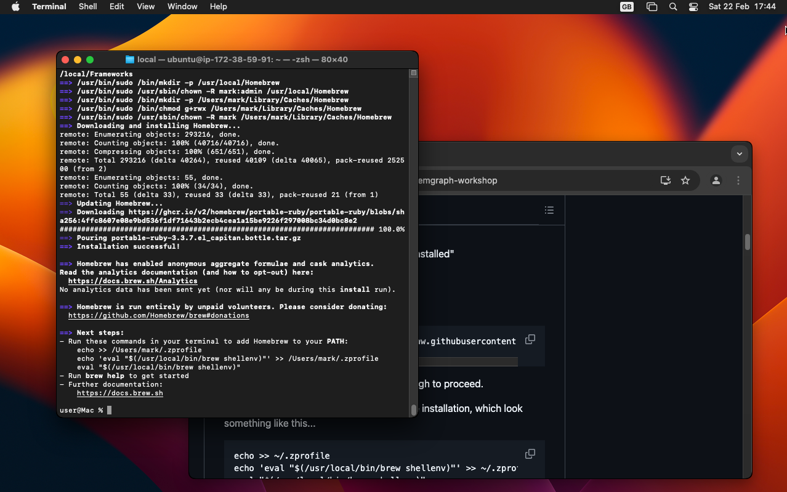

# Tools for the workshop

All of this takes place command line, so launch the Terminal window.

## Xcode

If you don't have X-code installed this installs the command line part, which
is massively smaller than the full X-code:

- `xcode-select --install`
- Click Install
- Wait until it says "command line tools installed"

## Homebrew

Homebrew is the 'missing software package manager' for MacOS.  You can
easily install and upgrade software packages for development tools and
other open-source stuff.

The magic installation incantation is:

```
/bin/bash -c "$(curl -fsSL https://raw.githubusercontent.com/Homebrew/install/HEAD/install.sh)"
```

You have to enter your user account password, and then hit RETURN part
way through to proceed.



You then follow the instructions to finish the installation, which look
something like this...

```
echo >> ~/.zprofile
echo 'eval "$(/usr/local/bin/brew shellenv)"' >> ~/.zprofile
eval "$(/usr/local/bin/brew shellenv)"
```

## Node

It _is_ possible to install Node using Homebrew, but I often have problems
so prefer to use the official Node installer.  Brew sometimes installs
unstable versions, so another reason to use this approach (NVM).

```
curl -o- https://raw.githubusercontent.com/nvm-sh/nvm/v0.40.1/install.sh | bash
. ~/.nvm/nvm.sh
```

This says to install Node version 22:

```
nvm install 22
```

## Python

Maybe you already have Python installed?  MacOS X-code insists in installing
something old, 3.9?  You can check with...

```
python3 --version
```

If it's older than 3.12, install Python 3.12...

```
brew install python@3.12
```

## Pulumi

This can be installed using Brew:

```
brew install pulumi
```
