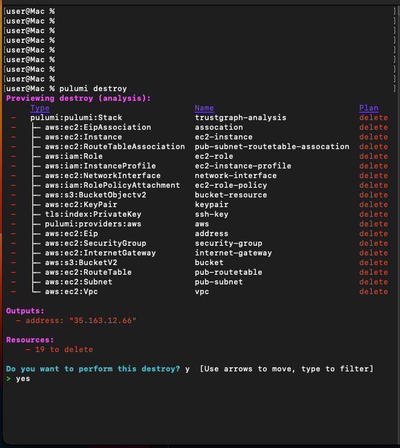

## Cleaning up

When you're done with everything, you can undeploy from the Pulumi directory
where you ran pulumi up...

```
pulumi destroy
```



If you created an AWS IAM user for this account, don't forget to delete it!

