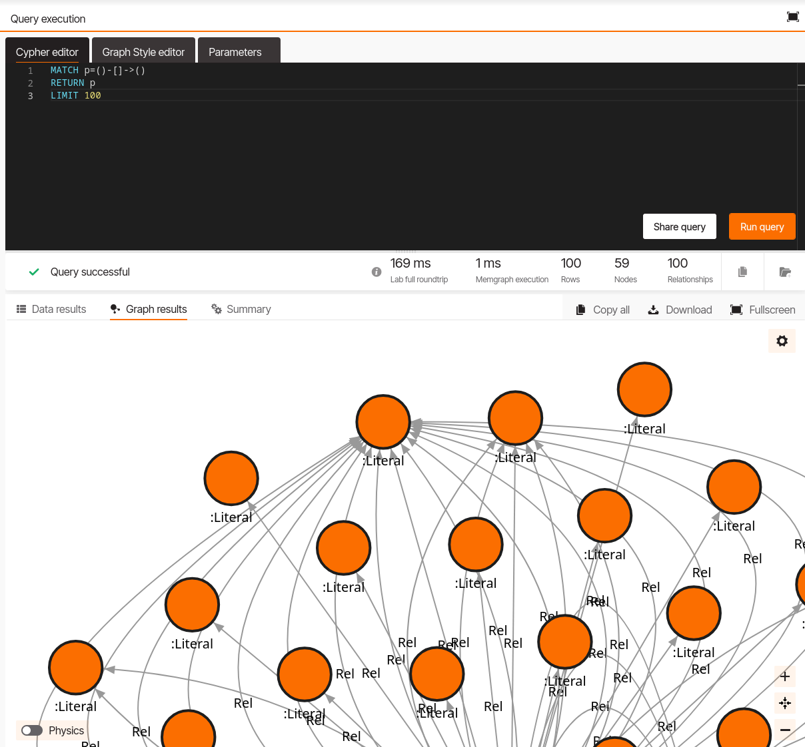
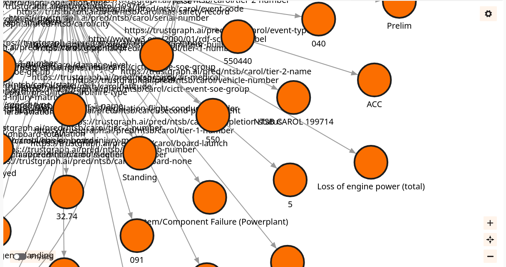
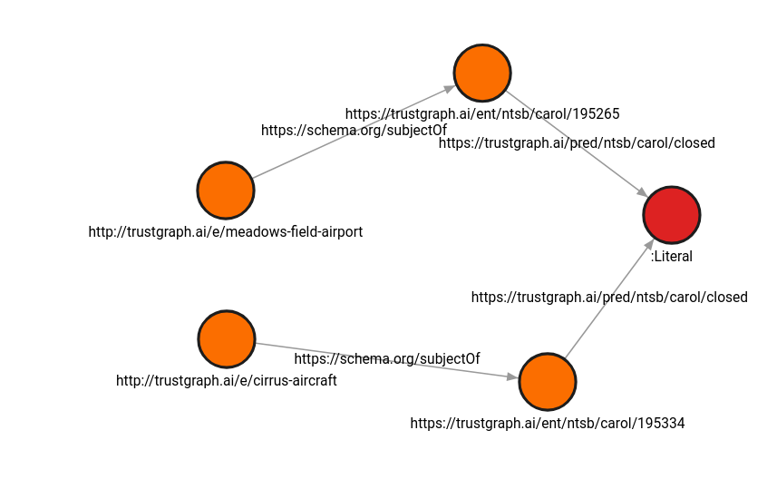
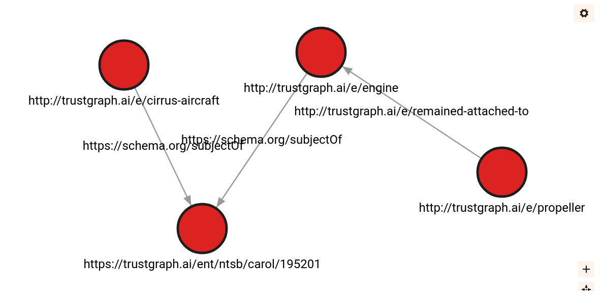

# Working with Memgraph

Memgraph is being used as the knowledge graph component in the TrustGraph
system.  If you're interested in knowledge graphs, it will be interesting
to take a look at how TrustGraph uses Memgraph, and also a lot of
extra functionality in Memgraph.

If you get bored of the TrustGraph-loaded data, there's other
datasets you can load into Memgraph on the Datasets tab.

## Memgraph lab

Connect to the lab at http://localhost:3010/

At the 'Quick connect' screen, click 'Connect now', which takes you to
the lab.

## Fetching something from the graph

A nice simple discovery query, fetches 100 edges from the graph:
```
MATCH p=()-[]->()
RETURN p
LIMIT 100
```

Then press 'Render using the system style'

This query is written in the Cypher language, documented here:

https://memgraph.com/docs/querying



This is only semi-useful, the labelling doesn't reveal anything.  To improve
the display:
- Click on a Node, select Display Options on the right, and change
  "Text on display" to "uri".  That labels the nodes with a URI.
- Click on an Edge, select Display Options on the right, and change
  "Text on display" to "uri".  That labels the edges with the uri that
  TrustGraph uses.

The layout isn't perfect, but you can see what each node is.



## Running a more advanced query

What's the connection between Meadows Field Airport and Cirrus Aircraft?

```
MATCH path=(n {uri: "http://trustgraph.ai/e/meadows-field-airport"})-[*ALLSHORTEST 5 (e,v | 1)]-(m {uri: "http://trustgraph.ai/e/cirrus-aircraft"})
RETURN path
LIMIT 1
```

This uses an advanced algorithm from the Memgraph toolbox.  It says,
find all the shortest paths between Meadows Field Airport and Cirrus Aircraft.
Return a maximum of 1 result.  The path algorithm is limited to 5 hops.

There's a little insider knowledge here, which is knowing how TrustGraph
encodes concepts into properties in the graph.



You may end up with a different view from me, but in my view, it says:
- Meadows Field Airport is mentioned in investigation 195265 which has
  now been closed.
- Cirrus Aircraft is mentioned in investigation 195334 which has also now
  been closed.
  
That's the connection???  Two unrelated reports have been closed?
Sorry, not as interesting as you were hoping for.  It's always possible
to improve the results of graph queries which is why you try them out in
a tool like memgraph lab first.

Try this query:

```
MATCH path=(n {uri: "http://trustgraph.ai/e/propeller"})-[*ALLSHORTEST 3 (e,v | 1)]-(m {uri: "http://trustgraph.ai/e/cirrus-aircraft"})
RETURN path
LIMIT 1
```

We're looking for a connection between Cirrus aircraft and a propeller.
Slightly more relevance to this: propeller remained attached to the engine
in investigation 195201, where Cirrus aircraft is also mentioned.



Try increasing the limit, changing hop size, and also changing the URIs to
see if you can find more interesting connections.  Or just changing the
query to filter out irrelevant things.

## What's next?

When you are finished:

[Undeploy, delete everything deployed earlier](undeploy.md)

