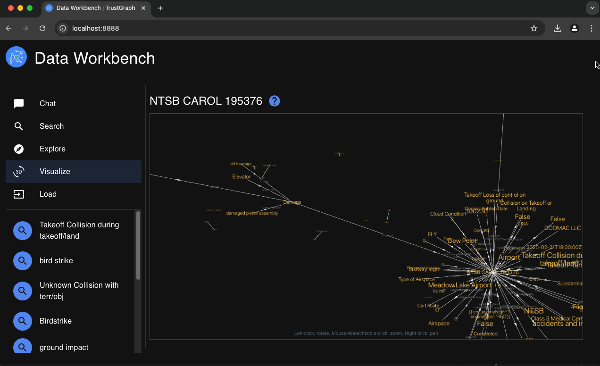

# Working with TrustGraph

## Dashboard

There's a Grafana dashboard running.  You can log into
http://localhost:3000 and look at the TrustGraph dashboard.
The login is user admin, password admin, and you can skip the password
change because the Grafana dashboard isn't available to anyone unless
they use an SSH tunnel like you did earlier.

The deploy leaves a single dashboard which should be listed on the home
page, if not, navigate into Dashboards and find the Overview dashboard.

## Workbench

Go to http://localhost:8888 to see the workbench.

## TrustGraph command-line

This sets up a Python 3.12 env directory, which we can put TrustGraph
things into...

```
mkdir -p ~/trustgraph/env
python3.12 -m venv ~/trustgraph/env
```

Configure to use this new environment.  This command need to be run in
any terminal window you want to run TrustGraph commands.

```
. ~/trustgraph/env/bin/activate
```

And then you can install some TrustGraph packages.  The CLI tools may be
useful...

```
pip install trustgraph-cli==0.20.11
```

## Using command-line

There's a command-line arg which talks straight to the LLM, so we can
check that LLM services are working.  `tg-invoke-llm` uses TrustGraph
services to respond to a prompt.  Two parts are provided: a system prompt
and a user prompt.  Try:

```
% tg-invoke-llm 'Be helpful' 'Describe San Francisco in 5 words'
Hilly, tech-driven, diverse, scenic, vibrant.
```

## Get hold of some test data

Cognitive cores are a quick way to load pre-generated data into TrustGraph,
ready for prompting.

Download the an NTSB accident dataset...

```
curl -o- https://raw.githubusercontent.com/trustgraph-ai/catalog/refs/heads/master/v3/ntsb.core.gz > ntsb.core.gz
gunzip ntsb.core.gz
```

And then you can load the core into TrustGraph...

```
tg-load-kg-core -i ntsb.core
```

You get a bit of debug output showing counts of loaded objects.  The core
takes a good few minutes to load, but after about a minute you're good to
start interacting with the data that's loaded on the workbench.

But you can also try a GraphRAG query on the command-line...

```
tg-invoke-graph-rag -q 'Describe an incident where an AA-5 was involved in a mid-air collision'
```

and

```
tg-invoke-graph-rag -q 'Who was the investigator for NTSB incident 199414'
```

## Quick look at Grafana

You loaded the data into processing queues.  There's a pub/sub backlog
chart which shows how much data there is waiting to be processed so you
can monitor load progress.

## Workbench

Things you can do...

- Ask questions in the Chat window, these are answered using the Graph RAG
  engine.
- Search for terms in the search window, this finds nodes in the knowledge
  graph.
- Click on resultant nodes in the search window, which shows you graph
  triples
- Click GRAPH VIEW to view a 3D knowledge graph of the triples you have
  discovered.
- This doesn't show the whole graph, you can click on nodes to add more
  information to the graph.
- Use the pointer to rotate space and move around the 3D space.




## What's next?

Next: [Working with Memgraph](using-memgraph.md)
